# Design Document: Docs Site Refinement

## Overview

This design addresses 22 requirements spanning technical debt cleanup, accessibility improvements, mathematical correctness verification, visual polish, and new interactive elements for the Froglet documentation site (`docs-site/`). The site is built on Astro 6 + Starlight 0.38.2 and currently suffers from monolithic CSS (~500 lines in `custom.css`), large inline `<script>` blocks in pages and MDX files, a ThemeProvider that forces dark mode, missing ARIA attributes on canvas elements, and magic numbers throughout canvas drawing code.

The design organizes work into five architectural layers:

1. **Module extraction** — Move inline scripts into typed TypeScript modules under `src/scripts/`, enabling testability and browser caching.
2. **CSS modularization** — Split `custom.css` into token, override, and component partials; extract inline styles from demo and 404 pages.
3. **Theme and accessibility** — Fix ThemeProvider to respect `prefers-color-scheme`, add ARIA attributes to canvases, add keyboard navigation to the demo.
4. **Mathematical correctness** — Verify all interactive economic charts compute values matching the formal model in `docs/KERNEL.md`.
5. **New interactive elements** — Add deal flow visualization, settlement calculator, and animated learn page diagrams using the same extracted module patterns.

All changes target the `docs-site/` directory. No changes to the Rust core, Python SDK, or protocol specification are required.

## Architecture

### Current State

```
docs-site/src/
├── components/          # 6 Astro components (SiteHeader, SiteFooter, ThemeProvider, Starlight*)
├── content/docs/learn/  # 7 MDX pages, 3 with inline <script> canvas code
├── data/nav-links.ts    # Navigation link data
├── pages/
│   ├── index.astro      # Landing page (~300 lines, inline trust graph + copy button scripts)
│   ├── demo.astro       # Demo page (~646 lines, inline whiteboard canvas + terminal animation)
│   └── 404.astro        # 404 page (inline styles, duplicate font import)
└── styles/
    ├── custom.css        # Monolithic (~500 lines: tokens + starlight overrides + components)
    └── index-page.css    # Landing page styles (~200 lines)
```

### Target State

```
docs-site/src/
├── components/          # Existing components with typed Props interfaces
├── content/docs/learn/  # MDX pages referencing external modules
├── data/nav-links.ts
├── pages/               # Pages importing external modules and stylesheets
├── scripts/             # NEW: TypeScript modules for all interactive behavior
│   ├── clipboard.ts             # Shared copy-to-clipboard logic (Req 2)
│   ├── trust-graph.ts           # Trust graph canvas renderer (Req 1, 7, 17)
│   ├── demo/
│   │   ├── whiteboard.ts        # Whiteboard canvas renderer (Req 1, 7)
│   │   ├── terminal.ts          # Terminal typing animation (Req 1)
│   │   ├── steps.ts             # Step data and navigation (Req 1, 6)
│   │   └── index.ts             # Demo page entry point
│   ├── settlement-viz.ts        # Settlement outcome canvas (Req 18)
│   ├── settlement-calculator.ts # NEW: Interactive settlement calculator (Req 21)
│   ├── chain-canvas.ts          # Deal flow chain canvas (Req 20)
│   ├── profit-chart.ts          # Provider profit vs quality canvas (Req 18)
│   ├── identity-diagram.ts      # NEW: Keypair generation diagram (Req 22)
│   ├── deal-flow-sequence.ts    # NEW: Animated sequence diagram (Req 22)
│   └── trust-threshold.ts       # NEW: Interactive trust threshold diagram (Req 22)
└── styles/
    ├── tokens.css               # Design tokens only (Req 8)
    ├── starlight-overrides.css  # Starlight theme overrides (Req 8)
    ├── components.css           # Reusable component styles (Req 8, 15)
    ├── custom.css               # Root entry point importing partials (Req 8)
    ├── index-page.css           # Landing page styles (existing, refined for Req 14, 16)
    ├── demo-page.css            # Demo page styles extracted from inline (Req 9)
    └── 404-page.css             # 404 page styles extracted from inline (Req 10)
```

### Module Dependency Graph

```mermaid
graph TD
    subgraph Pages
        INDEX[index.astro]
        DEMO[demo.astro]
        FOUR04[404.astro]
    end

    subgraph MDX
        ECON[economics.mdx]
        SETTLE[settlement.mdx]
        DEAL[deal-flow.mdx]
        IDENT[identity.mdx]
    end

    subgraph Scripts
        CLIP[clipboard.ts]
        TG[trust-graph.ts]
        WB[demo/whiteboard.ts]
        TERM[demo/terminal.ts]
        STEPS[demo/steps.ts]
        DENTRY[demo/index.ts]
        SV[settlement-viz.ts]
        SC[settlement-calculator.ts]
        CC[chain-canvas.ts]
        PC[profit-chart.ts]
        ID[identity-diagram.ts]
        DFS[deal-flow-sequence.ts]
        TT[trust-threshold.ts]
    end

    subgraph Styles
        TOK[tokens.css]
        SO[starlight-overrides.css]
        COMP[components.css]
        ENTRY[custom.css]
        IPC[index-page.css]
        DPC[demo-page.css]
        FPC[404-page.css]
    end

    INDEX --> CLIP
    INDEX --> TG
    DEMO --> DENTRY
    DENTRY --> WB
    DENTRY --> TERM
    DENTRY --> STEPS
    DENTRY --> CLIP
    ECON --> PC
    ECON --> TT
    SETTLE --> SV
    SETTLE --> SC
    DEAL --> CC
    DEAL --> DFS
    IDENT --> ID

    ENTRY --> TOK
    ENTRY --> SO
    ENTRY --> COMP
    INDEX --> IPC
    DEMO --> DPC
    FOUR04 --> FPC
```



## Components and Interfaces

### 1. Clipboard Module (`src/scripts/clipboard.ts`)

Shared copy-to-clipboard implementation used by all pages.

```typescript
export interface ClipboardButtonOptions {
  /** Text to display on success. Default: "Copied" */
  successText?: string;
  /** Text to display on failure. Default: "Failed" */
  failureText?: string;
  /** Duration in ms to show status text. Default: 1400 */
  resetDelay?: number;
}

/**
 * Initialize all copy buttons matching `[data-copy]` selector.
 * Each button copies the value of its `data-copy` attribute.
 */
export function initCopyButtons(
  root?: HTMLElement,
  options?: ClipboardButtonOptions
): void;

/**
 * Copy text to clipboard and manage button state.
 * Returns true on success, false on failure.
 */
export async function copyToClipboard(
  text: string,
  button: HTMLButtonElement,
  options?: ClipboardButtonOptions
): Promise<boolean>;
```

### 2. Trust Graph Module (`src/scripts/trust-graph.ts`)

Renders the stake-vs-fee cheat payoff chart on the landing page.

```typescript
export interface TrustGraphConfig {
  canvas: HTMLCanvasElement;
  stakeSlider: HTMLInputElement;
  feeSlider: HTMLInputElement;
  stakeDisplay: HTMLElement;
  feeDisplay: HTMLElement;
}

/** Layout constants replacing magic numbers */
export const TRUST_GRAPH_LAYOUT = {
  PADDING: { top: 24, right: 20, bottom: 40, left: 50 },
  MAX_RATIO: 5,
  FONT_AXIS_LABEL: '11px Inter, system-ui, sans-serif',
  FONT_TICK: '10px JetBrains Mono, monospace',
  COLORS: {
    background: '#0d1117',
    grid: '#1a2332',
    zeroLine: '#2d3748',
    cheatLine: '#f87171',
    safeZone: 'rgba(74, 222, 128, 0.06)',
    marker: '#fbbf24',
    currentSafe: '#4ade80',
    currentDanger: '#f87171',
  },
} as const;

/**
 * Compute cheat payoff: fee - stake.
 * Matches formal model: provider keeps fee, loses stake.
 */
export function computeCheatPayoff(stake: number, fee: number): number;

/**
 * Compute stake-to-fee ratio: stake / fee.
 */
export function computeRatio(stake: number, fee: number): number;

/**
 * Initialize the trust graph with slider bindings and initial render.
 */
export function initTrustGraph(config: TrustGraphConfig): void;
```

### 3. Demo Modules (`src/scripts/demo/`)

#### `steps.ts` — Step data and navigation

```typescript
export interface BoardNode {
  id: string;
  label: string;
  sub?: string;
  x: number;  // 0..1 normalized
  y: number;  // 0..1 normalized
  highlight?: boolean;
  small?: boolean;
}

export interface BoardArrow {
  from: string;
  to: string;
  label?: string;
  bidi?: boolean;
  style?: 'dashed';
  y?: number;
}

export interface BoardNote {
  text: string;
  x: number;
  y: number;
  size?: number;
  color?: 'accent' | 'warn' | 'muted';
}

export interface TerminalLine {
  p?: string;  // prompt (if present, `c` is the command to type)
  c?: string;  // command text
  o?: string;  // output line (if no `p`)
}

export interface Step {
  t: string;           // title
  d: string;           // description
  link: string;        // learn more URL
  note?: string;       // annotation HTML
  board: {
    nodes: BoardNode[];
    arrows: BoardArrow[];
    notes: BoardNote[];
  };
  term: TerminalLine[];
}

export const STEPS: Step[];
```

#### `whiteboard.ts` — Canvas renderer

```typescript
export const WHITEBOARD = {
  NODE_RADIUS: 48,
  NODE_RADIUS_SMALL: 28,
  ARROW_HEAD_SIZE: 8,
  ARROW_PAD: 52,
  GRID_SPACING_Y: 44,
  GRID_MIN_SPACING_X: 120,
  FRAME_MARGIN: 16,
  ANIMATION_DURATION_MS: 1200,
  CHALK_OFFSETS: [
    { dx: 0, dy: 0, alpha: 0.85 },
    { dx: -0.4, dy: 0.3, alpha: 0.18 },
    { dx: 0.35, dy: -0.25, alpha: 0.12 },
  ],
  COLORS: {
    bg: '#101712',
    grid: 'rgba(231,238,222,0.035)',
    text: '#edf1e7',
    muted: 'rgba(213,223,204,0.52)',
    accent: '#b8ff9a',
    accentDim: 'rgba(184,255,154,0.25)',
    warn: '#efe39a',
    frame: 'rgba(205,223,198,0.10)',
  },
  FONTS: {
    hand: "'Kalam', cursive",
    mono: "'JetBrains Mono', monospace",
  },
} as const;

export function initWhiteboard(
  canvas: HTMLCanvasElement,
  getStep: () => Step,
  getSceneStartedAt: () => number
): { resize: () => void; destroy: () => void };
```

#### `terminal.ts` — Terminal typing animation

```typescript
export interface TerminalAnimator {
  animate(lines: TerminalLine[]): Promise<void>;
  skip(): void;
  isTyping(): boolean;
  destroy(): void;
}

export function createTerminalAnimator(
  body: HTMLElement
): TerminalAnimator;
```

#### `index.ts` — Demo page entry point

```typescript
/**
 * Initializes the demo page: whiteboard, terminal, step navigation,
 * keyboard shortcuts, and pip indicators.
 */
export function initDemo(): void;
```

### 4. Settlement Calculator Module (`src/scripts/settlement-calculator.ts`)

New interactive widget for the settlement learn page.

```typescript
export interface SettlementInputs {
  baseFee: number;   // msat
  successFee: number; // msat
  cost: number;       // msat
}

export interface SettlementOutcome {
  scenario: 'success' | 'failure' | 'free';
  requesterOutflow: number;
  providerInflow: number;
  providerProfit: number;
}

/**
 * Compute all three settlement outcomes from inputs.
 * Success: requester pays base + success, provider receives base + success.
 * Failure: requester pays base only, provider receives base only.
 * Free: zero transfer.
 */
export function computeSettlementOutcomes(
  inputs: SettlementInputs
): SettlementOutcome[];

/**
 * Compute break-even quality threshold.
 * Returns (cost - baseFee) / successFee when successFee > 0, clamped to [0, 1].
 * Returns Infinity when successFee === 0 and baseFee < cost.
 * Returns 0 when baseFee >= cost.
 */
export function computeBreakEvenThreshold(inputs: SettlementInputs): number;

/**
 * Check if provider operates at a loss at full quality.
 */
export function isProviderAtLoss(inputs: SettlementInputs): boolean;

/**
 * Initialize the settlement calculator widget.
 */
export function initSettlementCalculator(container: HTMLElement): void;
```

### 5. Profit Chart Module (`src/scripts/profit-chart.ts`)

Extracted from economics.mdx inline script.

```typescript
export interface ProfitChartConfig {
  canvas: HTMLCanvasElement;
  baseFeeSlider: HTMLInputElement;
  successFeeSlider: HTMLInputElement;
  costSlider: HTMLInputElement;
  baseFeeDisplay: HTMLElement;
  successFeeDisplay: HTMLElement;
  costDisplay: HTMLElement;
  profitAtZeroDisplay: HTMLElement;
  profitAtOneDisplay: HTMLElement;
  breakEvenDisplay: HTMLElement;
  requesterValue: number; // fixed V
}

/**
 * Compute provider payoff at quality q: baseFee + q * successFee - cost.
 * Matches formal model E[π_P] = b_s + q·f_s - c.
 */
export function computeProviderPayoff(
  baseFee: number, successFee: number, cost: number, q: number
): number;

/**
 * Compute requester payoff at quality q: q * value - baseFee - q * successFee.
 * Matches formal model E[π_R] = q·v - b_s - q·f_s.
 */
export function computeRequesterPayoff(
  value: number, baseFee: number, successFee: number, q: number
): number;

export function initProfitChart(config: ProfitChartConfig): void;
```

### 6. ThemeProvider (`src/components/ThemeProvider.astro`)

Updated to respect system preference.

```typescript
// Inline script behavior (runs synchronously before paint):
// 1. Check for stored theme preference (future: localStorage)
// 2. If none, read window.matchMedia('(prefers-color-scheme: dark)')
// 3. Set document.documentElement.dataset.theme and style.colorScheme
// 4. Listen for matchMedia changes and update accordingly
```

### 7. Component Props Interfaces

All existing Astro components already have `Props` interfaces in their frontmatter. The design ensures they are complete:

- `SiteHeader`: `{ currentPath?: string; embedded?: boolean }` — already defined
- `SiteFooter`: `{ compact?: boolean }` — already defined
- `StarlightHeader`, `StarlightFooter`, `StarlightSidebar`: pass-through, no custom props needed

### 8. CSS Architecture

#### `tokens.css`
Contains only `:root` and `[data-theme='dark']` custom property declarations. Includes new tokens for standardized patterns:

```css
:root {
  /* Existing froglet-* tokens */
  /* NEW: standardized component tokens */
  --froglet-card-hover-shift: -1px;
  --froglet-grid-gap: 18px;
  --froglet-grid-gap-sm: 10px;
  --froglet-transition-fast: 140ms ease;
  /* NEW: tag color tokens */
  --froglet-tag-purple: 270 60% 62%;
  --froglet-tag-blue: 220 70% 62%;
  --froglet-tag-cyan: 185 60% 55%;
  --froglet-tag-green: 141 43% 36%;
  --froglet-tag-yellow: 45 80% 55%;
}
```

#### `starlight-overrides.css`
All `body > .page > header`, `nav.sidebar`, `.right-sidebar-panel`, `main[data-pagefind-body]`, `.sl-markdown-content`, and `.pagination-links` rules.

#### `components.css`
All reusable component patterns: `.learn-*`, `.plot-*`, `.protocol-*`, `.chapter-*`, `.compare-*`, `.trust-*` classes. Standardized card, button, and grid patterns using tokens.

#### `custom.css` (entry point)
```css
@import './tokens.css';
@import './starlight-overrides.css';
@import './components.css';
```

## Data Models

### Step Data (Demo Page)

The demo page step data is a static array of 11 `Step` objects (defined in `src/scripts/demo/steps.ts`). Each step contains:

| Field | Type | Description |
|-------|------|-------------|
| `t` | `string` | Step title |
| `d` | `string` | Step description (HTML) |
| `link` | `string` | "Learn more" URL |
| `note` | `string?` | Annotation HTML |
| `board.nodes` | `BoardNode[]` | Whiteboard node positions (normalized 0..1) |
| `board.arrows` | `BoardArrow[]` | Connections between nodes |
| `board.notes` | `BoardNote[]` | Handwritten-style text annotations |
| `term` | `TerminalLine[]` | Terminal output lines |

### Settlement Calculator State

```typescript
interface CalculatorState {
  baseFee: number;      // msat, range [0, 100_000]
  successFee: number;   // msat, range [0, 100_000]
  cost: number;         // msat, range [0, 100_000]
}
```

### Canvas Rendering State

Each canvas module maintains minimal internal state:

```typescript
interface CanvasState {
  ctx: CanvasRenderingContext2D | null;
  animationFrameId: number | null;
  width: number;
  height: number;
}
```

### Theme State

```typescript
type Theme = 'light' | 'dark';

interface ThemeState {
  current: Theme;
  source: 'system' | 'stored';
}
```

No persistent data models or database schemas are involved. All state is ephemeral, living in the browser session.

