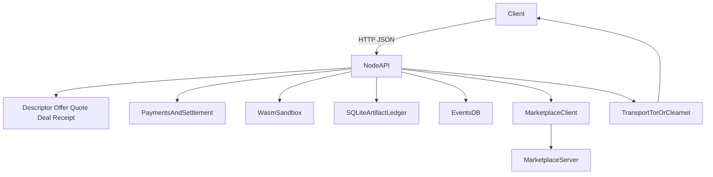

# Froglet

Froglet is a Rust node for small economic coordination between agents.

Its core primitive is a signed local ledger of:

- identity and transport descriptors
- priced offers
- short-lived quotes
- accepted deals
- terminal receipts

Execution, marketplaces, and brokers sit on top of that primitive rather than replacing it.

This repository now contains two binaries:

- `froglet`: the node runtime
- `marketplace`: a reference discovery service built alongside the node

## Features

- Native Tor hidden service support through Arti
- Stable secp256k1 node identity stored under `./data/identity/secp256k1.seed`
- Signed descriptor, offer, quote, deal, and receipt artifacts
- Append-only local artifact feed backed by SQLite
- Quote-based pricing for `events.query` and `execute.wasm`
- Deal execution with signed success, failure, or rejection receipts
- Central marketplace publishing with signed register and heartbeat flows
- Signed reclaim flow for bringing a node identity back online
- Lightning-first invoice-bundle settlement for priced deals
- Optional legacy Cashu verifier compatibility for inline-payment helpers
- Sandboxed Wasm execution
- Async job API with persisted state, polling, and idempotency keys as a compatibility layer
- SQLite state under `./data/node.db`
- SQLite tuned with WAL mode and busy timeout for better write/read behavior
- Async-friendly SQLite access via a small `DbPool` wrapper

## Binaries

### Node

```bash
cargo run --bin froglet
```

### Marketplace

```bash
cargo run --bin marketplace
```

The marketplace listens on `127.0.0.1:9090` by default and stores state in `./data/marketplace.db`.

## Node Configuration

### Core transport

- `FROGLET_NETWORK_MODE=clearnet|tor|dual`
- `FROGLET_LISTEN_ADDR=127.0.0.1:8080`
- `FROGLET_DATA_DIR=./data`

### Discovery and marketplace

- `FROGLET_DISCOVERY_MODE=none|marketplace`
- `FROGLET_MARKETPLACE_URL=http://127.0.0.1:9090`
- `FROGLET_MARKETPLACE_PUBLISH=true|false`
- `FROGLET_MARKETPLACE_REQUIRED=true|false`
- `FROGLET_MARKETPLACE_HEARTBEAT_INTERVAL_SECS=30`

### Identity

- `FROGLET_IDENTITY_AUTO_GENERATE=true|false`

If auto-generation is enabled and no seed file exists, Froglet creates one on first boot and reuses it on subsequent starts.

### Pricing and payments

- `FROGLET_PRICE_EVENTS_QUERY=0`
- `FROGLET_PRICE_EXEC_WASM=0`
- `FROGLET_PAYMENT_BACKEND=none|cashu|lightning`
- `FROGLET_EXECUTION_TIMEOUT_SECS=10`
- `FROGLET_CASHU_MINT_ALLOWLIST=https://mint.example,https://mint2.example`
- `FROGLET_CASHU_REMOTE_CHECKSTATE=true|false`
- `FROGLET_CASHU_REQUEST_TIMEOUT_SECS=5`
- `FROGLET_LIGHTNING_MODE=mock`

If any price is greater than zero and `FROGLET_PAYMENT_BACKEND` is not set, Froglet defaults to `lightning`.
The mainline priced v1 flow is `quote -> deal -> receipt`.
The older inline-payment query and job helpers remain available only as explicit legacy compatibility when `FROGLET_PAYMENT_BACKEND=cashu`.

`FROGLET_EXECUTION_TIMEOUT_SECS` is enforced by the Wasm sandbox adapter and is also published in offer constraints.

When `FROGLET_CASHU_MINT_ALLOWLIST` is set, only tokens from those mints are accepted. If `FROGLET_CASHU_REMOTE_CHECKSTATE=true`, Froglet additionally calls the mint's NUT-07 `/v1/checkstate` endpoint before reserving the token. Remote checkstate requires a non-empty mint allowlist.

## Marketplace Configuration

- `FROGLET_MARKETPLACE_LISTEN_ADDR=127.0.0.1:9090`
- `FROGLET_MARKETPLACE_DB_PATH=./data/marketplace.db`
- `FROGLET_MARKETPLACE_STALE_AFTER_SECS=300`

If a published node stays offline longer than the stale threshold, the marketplace marks it inactive and requires signed reclaim before accepting fresh registrations from that identity again.

## Architecture Overview

At a high level, clients talk HTTP/JSON to a small protocol surface that issues quotes, accepts deals, persists signed artifacts, optionally executes workloads, and can publish into external discovery systems:



Security and performance-critical paths sit at the `payments`, `sandbox`, and `ledger` layers: quoted prices are enforced before execution, terminal receipts are signed, and the database is always accessed behind an async wrapper to avoid blocking the reactor.

## Example Flows

### Free local node

```bash
cargo run --bin froglet
```

### Public node that auto-publishes to marketplace

Start the marketplace:

```bash
cargo run --bin marketplace
```

Start the node:

```bash
FROGLET_DISCOVERY_MODE=marketplace \
FROGLET_MARKETPLACE_URL=http://127.0.0.1:9090 \
FROGLET_MARKETPLACE_PUBLISH=true \
cargo run --bin froglet
```

### Legacy paid query endpoint

```bash
FROGLET_PRICE_EVENTS_QUERY=10 \
FROGLET_PAYMENT_BACKEND=cashu \
cargo run --bin froglet
```

Requests to `/v1/node/events/query` require a payment object only in the legacy Cashu compatibility mode:

```json
{
  "kinds": ["note"],
  "limit": 5,
  "payment": {
    "kind": "cashu",
    "token": "cashuA..."
  }
}
```

If payment is missing, Froglet returns `402 Payment Required`.
When `FROGLET_PAYMENT_BACKEND=lightning`, priced `events.query` requests must go through `/v1/quotes` and `/v1/deals` instead of this helper endpoint.

### Quote and deal flow

```json
POST /v1/quotes
{
  "offer_id": "execute.wasm",
  "kind": "wasm",
  "submission": {
    "schema_version": "froglet/v1",
    "submission_type": "wasm_submission",
    "workload": {
      "schema_version": "froglet/v1",
      "workload_kind": "compute.wasm.v1",
      "abi_version": "froglet.wasm.run_json.v1",
      "module_format": "application/wasm",
      "module_hash": "<sha256 of raw wasm bytes>",
      "input_format": "application/json+jcs",
      "input_hash": "<sha256 of canonical JSON input>",
      "requested_capabilities": []
    },
    "module_bytes_hex": "0061736d...",
    "input": null
  }
}
```

The node responds with a signed quote artifact. The client can then open a deal against that quote.
In legacy Cashu compatibility mode, the deal can still carry an inline payment token:

```json
POST /v1/deals
{
  "quote": { "...": "signed quote artifact" },
  "kind": "wasm",
  "submission": {
    "...": "same wasm_submission used for quoting"
  },
  "payment": {
    "kind": "cashu",
    "token": "cashuA..."
  }
}
```

Froglet persists the accepted deal immediately, executes it asynchronously, and returns a signed receipt when the deal reaches `succeeded`, `failed`, or `rejected`.
New receipts include the signed deal hash, result format metadata, executor/runtime metadata, and the applied runtime limit profile for the workload.
If compute capacity is exhausted before execution begins, the provider emits a signed terminal rejection receipt and releases any local payment reservation.

With `FROGLET_PAYMENT_BACKEND=lightning`, priced deals use a pending-admission flow:

```json
POST /v1/deals
{
  "quote": { "...": "signed quote artifact" },
  "kind": "wasm",
  "submission": {
    "...": "same wasm_submission used for quoting"
  },
  "requester_id": "<32-byte x-only pubkey hex>",
  "success_payment_hash": "<sha256(secret) hex>"
}
```

The deal is persisted as `payment_pending`. The requester then fetches the signed bundle from `GET /v1/deals/:deal_id/invoice-bundle`. In mock Lightning mode, local tests can advance bundle state through `POST /v1/runtime/lightning/invoice-bundles/:session_id/state` until the deal is admitted and executed.
Before either Lightning leg is paid, Froglet can verify the returned bundle against the signed quote and deal via `POST /v1/invoice-bundles/verify`.

### Async FaaS-style job submission

```json
POST /v1/node/jobs
{
  "kind": "wasm",
  "submission": {
    "...": "wasm_submission"
  },
  "idempotency_key": "hello-world-job"
}
```

Froglet returns a persisted job record immediately and clients can poll `GET /v1/node/jobs/:job_id` until the status changes to `succeeded` or `failed`.
If `execute.wasm` is priced and the Lightning backend is active, `POST /v1/node/jobs` is intentionally demoted from the v1 economic path and returns an error instructing callers to use `/v1/quotes` and `/v1/deals`.

## API Surface

### Node routes

- `GET /health`
- `GET /v1/descriptor`
- `GET /v1/offers`
- `GET /v1/feed`
- `GET /v1/artifacts/:artifact_hash`
- `POST /v1/quotes`
- `POST /v1/deals`
- `GET /v1/deals/:deal_id`
- `GET /v1/deals/:deal_id/invoice-bundle`
- `POST /v1/invoice-bundles/verify`
- `POST /v1/receipts/verify`
- `GET /v1/node/capabilities`
- `GET /v1/node/identity`
- `POST /v1/node/events/publish`
- `POST /v1/node/events/query` for free queries or explicit legacy Cashu mode
- `POST /v1/node/execute/wasm` for free execution only
- `POST /v1/node/jobs` for free execution only
- `GET /v1/node/jobs/:job_id`
- `POST /v1/node/pay/ecash`

### Runtime routes

- `GET /v1/runtime/wallet/balance`
- `POST /v1/runtime/provider/start`
- `POST /v1/runtime/services/publish`
- `POST /v1/runtime/services/buy`
- `GET /v1/runtime/archive/:subject_kind/:subject_id`
- `POST /v1/runtime/lightning/invoice-bundles/:session_id/state`

`GET /v1/feed` uses an exclusive cursor over the local artifact sequence.
Pass `?cursor=<last_seen_cursor>&limit=<n>` to continue replication from the last artifact you processed.
Use `GET /v1/artifacts/:artifact_hash` to resolve a specific content-addressed artifact by hash.

`GET /v1/runtime/archive/:subject_kind/:subject_id` is a privileged export surface for retained local evidence. It returns an engine-neutral archive bundle containing the subject's retained artifact documents, local feed entries, execution evidence, and any retained Lightning invoice-bundle material.

### Marketplace routes

- `GET /health`
- `POST /v1/marketplace/register`
- `POST /v1/marketplace/heartbeat`
- `POST /v1/marketplace/reclaim/challenge`
- `POST /v1/marketplace/reclaim/complete`
- `GET /v1/marketplace/nodes/:node_id`
- `GET /v1/marketplace/search`

## Capability Example

```json
{
  "api_version": "v1",
  "version": "0.1.0",
  "identity": {
    "node_id": "<pubkey-hex>",
    "public_key": "<pubkey-hex>"
  },
  "discovery": {
    "mode": "marketplace"
  },
  "marketplace": {
    "enabled": true,
    "publish_enabled": true,
    "url": "http://127.0.0.1:9090",
    "connected": true
  },
  "pricing": {
    "events_query": {
      "service_id": "events.query",
      "price_sats": 10,
      "payment_required": true
    }
  },
  "faas": {
    "jobs_api": true,
    "async_jobs": true,
    "idempotency_keys": true,
    "runtimes": ["wasm"]
  }
}
```

## Notes on Payments

Paid endpoint enforcement currently does two things:

- validates Cashu token structure and amount
- optionally enforces a mint allowlist and checks proof state against the mint via NUT-07
- reserves the token locally before execution and only commits it on success
- records explicit local settlement outcomes as `reserved`, `committed`, `released`, or `expired`
- binds deal execution to the quoted price, not just the current endpoint default
- returns signed terminal receipts that can be verified offline, including reserved-versus-committed settlement amounts

If execution fails, Froglet marks the local reservation as `released` so the token is not consumed by a failed request and can be presented again later.

If the node restarts while a deal is still accepted or running, Froglet marks the local reservation as `expired` and emits a signed terminal failure receipt for that interrupted deal during startup recovery.

It does **not** redeem tokens against a mint or wallet backend. Replay protection is strictly **local to a single node**: the token hash is only compared against the node's own settlement state tables, and a token could in principle be reused at other nodes that do not share this state.

The verifier is isolated behind a dedicated module so a stronger backend (for example, a real mint/wallet or remote verifier) can replace the current implementation without changing the API surface.

### Threat Model (Current)

- The node is expected to run in a controlled environment (edge node or personal server), exposed to untrusted clients over HTTP.
- API routes are unauthenticated by default; protection is based on:
  - static pricing and payment verification for sensitive endpoints,
  - input validation,
  - sandboxing of Wasm with fuel caps, memory caps, and global concurrency limits,
  - basic rate limiting and explicit body size limits on publish/execute routes.
- Payments:
  - Cashu tokens are parsed and checked for amount.
  - Optional mint allowlists and NUT-07 checkstate verification can reject tokens before reservation.
  - A local `reserved -> committed|released|expired` lifecycle prevents a successful token from being used twice **on the same node** while still preserving local failure state.
  - Failed executions mark their reservation as `released` and do not intentionally consume the token.
  - There is no global double-spend protection without an external mint/wallet integration.
- Storage and identities:
  - Identity seeds, database files, and Tor state/cache directories are created with strict `0o600/0o700` permissions on Unix.
  - Failure to secure Tor directories now causes startup to fail with a clear error.

If you deploy Froglet on the public internet, you should still front it with additional protections (reverse proxy, WAF, external rate limiting, etc.) and carefully tune prices and limits for your threat model.

### Operational Notes

- **Rotate identity**: stop the node, delete `./data/identity/secp256k1.seed`, and restart with `FROGLET_IDENTITY_AUTO_GENERATE=true` to mint a fresh node identity.
- **Migrate DB**: stop the node, copy `./data/node.db` (and `./data/marketplace.db` if running the marketplace) to the new location, update `FROGLET_DATA_DIR`, and restart.
- **Toggle Tor/clearnet**:
  - Use `FROGLET_NETWORK_MODE=clearnet|tor|dual` to control which transports are enabled.
  - In `tor` mode, failure to start the Tor hidden service is treated as fatal.
- **Marketplace publishing**:
  - Use `FROGLET_MARKETPLACE_PUBLISH` and `FROGLET_MARKETPLACE_REQUIRED` to control whether publishing is best-effort or mandatory.
  - The node's marketplace sync loop now applies exponential backoff after repeated failures while keeping status information visible via `/v1/node/capabilities`.

## Development

Build and test:

```bash
cargo check
cargo test --lib --bins
```
