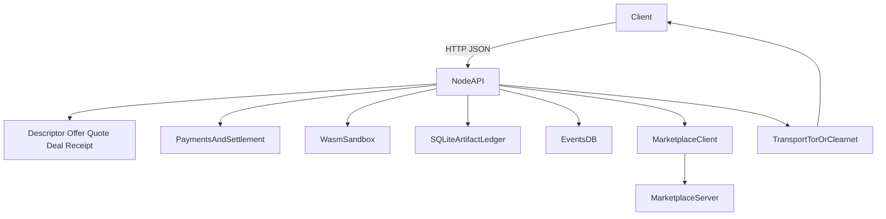

# Froglet

Froglet is a Rust node for small economic coordination between agents.

Its core primitive is a signed local ledger of:

- identity and transport descriptors
- priced offers
- short-lived quotes
- accepted deals
- terminal receipts

Execution, marketplaces, and brokers sit on top of that primitive rather than replacing it.

This repository now contains two binaries:

- `froglet`: the node runtime
- `marketplace`: a reference discovery service built alongside the node

## Repository Docs

- [SPEC.md](SPEC.md): frozen v1 economic kernel
- [BOT_RUNTIME_ALPHA.md](BOT_RUNTIME_ALPHA.md): supported bot-facing alpha runtime surface
- [OPERATOR.md](OPERATOR.md): operator guidance for wallet setup, auth, archive export, and recovery
- [RUNTIME.md](RUNTIME.md): non-normative runtime design notes
- [REMOTE_AGENT_LAYER.md](REMOTE_AGENT_LAYER.md): planned long-running remote-agent layer above the v1 primitive
- [examples/README.md](examples/README.md): runnable Python example integrations

## Support Matrix

Primitive core, intended stable release surface:

- signed descriptor, offer, quote, deal, receipt, curated-list, and invoice-bundle artifacts
- local SQLite-backed artifact, deal, job, and evidence persistence
- public provider routes for descriptor, offers, quotes, deals, verification, feed, and archive-backed artifacts
- restart recovery for persisted accepted, running, `payment_pending`, and `result_ready` deal state

Supported alpha surfaces above the primitive:

- `/v1/runtime/*` local runtime routes
- `froglet_client.py` and the bot-facing helper workflow
- marketplace publish/search flows
- external `tor` sidecar transport publication
- `lnd_rest` Lightning integration
- `froglet_nostr_adapter.py` publication helpers

Operationally useful but not part of the stable primitive contract:

- reference `marketplace` binary
- relay publication policy and adapter behavior
- local runtime convenience flows that compress multiple primitive steps

Dev/test-only surfaces:

- mock-Lightning invoice-bundle state mutation through `/v1/runtime/lightning/invoice-bundles/:session_id/state`
- env-gated Tor and real-LND integration harnesses

Release guarantee boundary:

- the primitive is the signed artifact kernel plus durable local state transitions
- alpha/runtime/service layers may evolve faster than the primitive and should not be treated as a frozen compatibility contract yet

## Features

- Managed external Tor hidden service sidecar support
- Stable secp256k1 node identity stored under `./data/identity/secp256k1.seed`
- Signed descriptor, offer, quote, deal, and receipt artifacts
- Append-only local artifact feed backed by SQLite
- Quote-based pricing for `events.query` and `execute.wasm`
- Deal execution with signed success, failure, or rejection receipts
- Central marketplace publishing with signed register and heartbeat flows
- Signed reclaim flow for bringing a node identity back online
- Lightning-first invoice-bundle settlement for priced deals
- LND REST client boundary for future real hold-invoice settlement
- Sandboxed Wasm execution
- Async job API with persisted state, polling, and idempotency keys as a compatibility layer
- SQLite state under `./data/node.db`
- SQLite tuned with WAL mode and busy timeout for better write/read behavior
- Async-friendly SQLite access via a small `DbPool` wrapper

## Binaries

### Node

```bash
cargo run --bin froglet
```

### Marketplace

```bash
cargo run --bin marketplace
```

The marketplace listens on `127.0.0.1:9090` by default and stores state in `./data/marketplace.db`.

## Node Configuration

### Core transport

- `FROGLET_NETWORK_MODE=clearnet|tor|dual`
- `FROGLET_LISTEN_ADDR=127.0.0.1:8080`
- `FROGLET_RUNTIME_LISTEN_ADDR=127.0.0.1:8081`
- `FROGLET_TOR_BACKEND_LISTEN_ADDR=127.0.0.1:8082`
- `FROGLET_TOR_BINARY=tor`
- `FROGLET_TOR_STARTUP_TIMEOUT_SECS=90`
- `FROGLET_DATA_DIR=./data`

Default local listener roles:

- `FROGLET_LISTEN_ADDR`: public provider API for `/v1/descriptor`, `/v1/offers`, `/v1/quotes`, `/v1/deals`, and verification routes
- `FROGLET_RUNTIME_LISTEN_ADDR`: privileged local runtime API for `/v1/runtime/*`
- `FROGLET_TOR_BACKEND_LISTEN_ADDR`: internal loopback-only HTTP backend that the external `tor` sidecar publishes as the onion service

`FROGLET_RUNTIME_LISTEN_ADDR` and `FROGLET_TOR_BACKEND_LISTEN_ADDR` are separate trust boundaries. Neither should be exposed directly on a public interface.

### Discovery and marketplace

- `FROGLET_DISCOVERY_MODE=none|marketplace`
- `FROGLET_MARKETPLACE_URL=http://127.0.0.1:9090`
- `FROGLET_MARKETPLACE_PUBLISH=true|false`
- `FROGLET_MARKETPLACE_REQUIRED=true|false`
- `FROGLET_MARKETPLACE_HEARTBEAT_INTERVAL_SECS=30`

### Identity

- `FROGLET_IDENTITY_AUTO_GENERATE=true|false`

If auto-generation is enabled and no seed file exists, Froglet creates one on first boot and reuses it on subsequent starts.

### Pricing and payments

- `FROGLET_PRICE_EVENTS_QUERY=0`
- `FROGLET_PRICE_EXEC_WASM=0`
- `FROGLET_PAYMENT_BACKEND=none|lightning`
- `FROGLET_EXECUTION_TIMEOUT_SECS=10`
- `FROGLET_LIGHTNING_MODE=mock|lnd_rest`
- `FROGLET_LIGHTNING_REST_URL=https://127.0.0.1:8080`
- `FROGLET_LIGHTNING_TLS_CERT_PATH=/path/to/tls.cert`
- `FROGLET_LIGHTNING_MACAROON_PATH=/path/to/admin.macaroon`
- `FROGLET_LIGHTNING_REQUEST_TIMEOUT_SECS=5`
- `FROGLET_LIGHTNING_SYNC_INTERVAL_MS=1000`

If any price is greater than zero and `FROGLET_PAYMENT_BACKEND` is not set, Froglet defaults to `lightning`.
The mainline priced v1 flow is `quote -> deal -> receipt`.
`FROGLET_LIGHTNING_MODE=lnd_rest` now provides the real LND REST boundary for invoice creation, lookup, cancel, and settle operations. Froglet still uses the same explicit requester preimage-release step for the success-fee hold leg, and the background Lightning watcher reconciles `payment_pending` and `result_ready` deals on a fixed interval.
When `FROGLET_LIGHTNING_REST_URL` is HTTPS, `FROGLET_LIGHTNING_TLS_CERT_PATH` is treated as a pinned LND server certificate rather than as a generic WebPKI CA bundle. This matches the way local LND admin endpoints typically expose self-signed TLS material.
The test suite now covers both a synthetic LND REST backend that emits real BOLT11 invoices and an env-gated Dockerized regtest topology with real LND nodes, hold invoices, settlement, cancellation, and watcher-driven restart recovery.
The repo also now ships a small async Python helper in `froglet_client.py` so local agents can search, quote, open deals, wait on state transitions, and accept results without hardcoding route names or parsing payment-intent details on the default path.
There is also an env-gated Tor integration test, enabled with `FROGLET_RUN_TOR_INTEGRATION=1`, that boots `dual` transport mode against the external `tor` sidecar and verifies descriptor/capability parity once the onion endpoint comes up.

`FROGLET_EXECUTION_TIMEOUT_SECS` is enforced by the Wasm sandbox adapter and is also published in offer constraints.
The public API listener and the privileged runtime listener are intentionally separate. Keep `FROGLET_RUNTIME_LISTEN_ADDR` on loopback unless you are deliberately changing the trust boundary.
The Tor sidecar backend is also intentionally separate from both of those listeners. Keep `FROGLET_TOR_BACKEND_LISTEN_ADDR` on loopback; it is not an authenticated surface.

## Marketplace Configuration

- `FROGLET_MARKETPLACE_LISTEN_ADDR=127.0.0.1:9090`
- `FROGLET_MARKETPLACE_DB_PATH=./data/marketplace.db`
- `FROGLET_MARKETPLACE_STALE_AFTER_SECS=300`

If a published node stays offline longer than the stale threshold, the marketplace marks it inactive and requires signed reclaim before accepting fresh registrations from that identity again.

## Architecture Overview

At a high level, clients talk HTTP/JSON to a small protocol surface that issues quotes, accepts deals, persists signed artifacts, optionally executes workloads, and can publish into external discovery systems:



Security and performance-critical paths sit at the `payments`, `sandbox`, and `ledger` layers: quoted prices are enforced before execution, terminal receipts are signed, and the database is always accessed behind an async wrapper to avoid blocking the reactor.

## Example Flows

### Free local node

```bash
cargo run --bin froglet
```

### Public node that auto-publishes to marketplace

Start the marketplace:

```bash
cargo run --bin marketplace
```

Start the node:

```bash
FROGLET_DISCOVERY_MODE=marketplace \
FROGLET_MARKETPLACE_URL=http://127.0.0.1:9090 \
FROGLET_MARKETPLACE_PUBLISH=true \
cargo run --bin froglet
```

### Dual transport node with external Tor sidecar

This assumes a `tor` binary is installed and available on `PATH` or explicitly configured via `FROGLET_TOR_BINARY`.

```bash
FROGLET_NETWORK_MODE=dual \
FROGLET_TOR_BINARY=tor \
FROGLET_LISTEN_ADDR=127.0.0.1:8080 \
FROGLET_RUNTIME_LISTEN_ADDR=127.0.0.1:8081 \
FROGLET_TOR_BACKEND_LISTEN_ADDR=127.0.0.1:8082 \
cargo run --bin froglet
```

In this layout:

- clearnet clients reach `127.0.0.1:8080`
- local bots reach `127.0.0.1:8081`
- the `tor` sidecar reaches `127.0.0.1:8082` and publishes that backend as the onion service

### Free query helper endpoint

```bash
cargo run --bin froglet
```

Requests to `/v1/node/events/query` are available directly when the service is free:

```json
{
  "kinds": ["note"],
  "limit": 5
}
```

When `FROGLET_PAYMENT_BACKEND=lightning`, priced `events.query` requests must go through `/v1/quotes` and `/v1/deals` instead of this helper endpoint.

### Quote and deal flow

```json
POST /v1/quotes
{
  "offer_id": "execute.wasm",
  "kind": "wasm",
  "submission": {
    "schema_version": "froglet/v1",
    "submission_type": "wasm_submission",
    "workload": {
      "schema_version": "froglet/v1",
      "workload_kind": "compute.wasm.v1",
      "abi_version": "froglet.wasm.run_json.v1",
      "module_format": "application/wasm",
      "module_hash": "<sha256 of raw wasm bytes>",
      "input_format": "application/json+jcs",
      "input_hash": "<sha256 of canonical JSON input>",
      "requested_capabilities": []
    },
    "module_bytes_hex": "0061736d...",
    "input": null
  }
}
```

The node responds with a signed quote artifact. The client can then open a deal against that quote.
For public `compute.wasm.v1` workloads, Froglet rejects any module that declares host imports, shared memories, 64-bit memories, or memory bounds above the published v1 limit before execution begins.
The interoperable v1 determinism profile is intentionally narrow: module, input, and result identity are all hash-based, and the public ABI exposes no ambient filesystem, network, clock, or randomness capabilities.

Froglet persists the accepted deal immediately, executes it asynchronously, and returns a signed receipt when the deal reaches `succeeded`, `failed`, or `rejected`.
New receipts include the signed deal hash, result format metadata, executor/runtime metadata, and the applied runtime limit profile for the workload.
If compute capacity is exhausted before execution begins, the provider emits a signed terminal rejection receipt and releases any local payment reservation.

With `FROGLET_PAYMENT_BACKEND=lightning`, priced deals use a pending-admission flow:

```json
POST /v1/deals
{
  "quote": { "...": "signed quote artifact" },
  "kind": "wasm",
  "submission": {
    "...": "same wasm_submission used for quoting"
  },
  "requester_id": "<32-byte x-only pubkey hex>",
  "success_payment_hash": "<sha256(secret) hex>"
}
```

The deal is persisted as `payment_pending`. The requester can still fetch the signed transport bundle from `GET /v1/deals/:deal_id/invoice-bundle`, but the local runtime now exposes a wallet-facing `payment_intent` on `POST /v1/runtime/services/buy` and `GET /v1/runtime/deals/:deal_id/payment-intent` so agents do not need to parse raw invoice-bundle legs on the happy path. Once the base leg is settled and the success hold is accepted, Froglet admits the deal, executes it, and stages the completed result as `result_ready`.
The deal does not become terminal at that point. The requester must explicitly accept the success-fee leg by calling `POST /v1/deals/:deal_id/release-preimage` with the original 32-byte secret whose hash was committed as `success_payment_hash`. Only after that release does Froglet settle the hold and emit the final signed receipt.
When a bundle is issued, Froglet clamps each Lightning leg's expiry to the remaining lifetime of the accepted quote so the returned invoices cannot outlive the quoted commitment window.
Lightning-priced Wasm execution now follows the configured execution limit directly. Operators are responsible for setting `FROGLET_EXECUTION_TIMEOUT_SECS` to a value that matches their settlement and resource-risk tolerance.
Lightning-backed deals are also reconciled in the background, so `payment_pending` and `result_ready` deals can progress or fail after restart without requiring a status-polling request to trigger sync.
In mock Lightning mode, local tests can advance bundle state through `POST /v1/runtime/lightning/invoice-bundles/:session_id/state` until the deal is admitted and executed.
Before either Lightning leg is paid, Froglet can verify the returned bundle against the signed quote and deal via `POST /v1/invoice-bundles/verify`.

### Async FaaS-style job submission

```json
POST /v1/node/jobs
{
  "kind": "wasm",
  "submission": {
    "...": "wasm_submission"
  },
  "idempotency_key": "hello-world-job"
}
```

Froglet returns a persisted job record immediately and clients can poll `GET /v1/node/jobs/:job_id` until the status changes to `succeeded` or `failed`.
If `execute.wasm` is priced and the Lightning backend is active, `POST /v1/node/jobs` is intentionally demoted from the v1 economic path and returns an error instructing callers to use `/v1/quotes` and `/v1/deals`.

## API Surface

### Node routes

- `GET /health`
- `GET /v1/descriptor`
- `GET /v1/offers`
- `GET /v1/feed`
- `GET /v1/artifacts/:artifact_hash`
- `POST /v1/quotes`
- `POST /v1/deals`
- `GET /v1/deals/:deal_id`
- `POST /v1/deals/:deal_id/release-preimage`
- `GET /v1/deals/:deal_id/invoice-bundle`
- `POST /v1/invoice-bundles/verify`
- `POST /v1/curated-lists/verify`
- `POST /v1/nostr/events/verify`
- `POST /v1/receipts/verify`
- `GET /v1/node/capabilities`
- `GET /v1/node/identity`
- `POST /v1/node/events/publish`
- `POST /v1/node/events/query` for free queries only
- `POST /v1/node/execute/wasm` for free execution only
- `POST /v1/node/jobs` for free execution only
- `GET /v1/node/jobs/:job_id`

## Agent Helper

`froglet_client.py` provides three small async helpers:

- `MarketplaceClient` for `search` and node lookup
- `ProviderClient` for `quote -> deal -> wait -> accept -> receipt`
- `RuntimeClient` for authenticated local bot flows, curated-list issuance, and optional payment-intent inspection

The runtime helper defaults to compact deal handles and omits raw `payment_intent` details unless `include_payment_intent=True` is requested.
It also exposes Nostr summary publication helpers for the current provider surface and terminal deal receipts without requiring relay access.
Runtime helpers should target the dedicated runtime listener, while `ProviderClient` continues to target the public provider listener.
Requester-side convenience helpers are also provided so local bots can generate a seed and construct local-only signing inputs without depending on `test_support.py`. The SDK consumes these values client-side and sends only signed quote/deal artifacts over HTTP:

- `generate_requester_seed()`
- `requester_id_from_seed(seed)`
- `runtime_requester_fields(seed, success_preimage)`

For the intended supported product path, see [BOT_RUNTIME_ALPHA.md](BOT_RUNTIME_ALPHA.md).
For runnable integrations, see [examples/README.md](examples/README.md).
For the strict local verification matrix used during hardening, run `./scripts/strict_checks.sh`.

### Runtime routes

- `GET /v1/runtime/wallet/balance`
- `POST /v1/runtime/provider/start`
- `POST /v1/runtime/services/publish`
- `POST /v1/runtime/services/buy`
- `POST /v1/runtime/discovery/curated-lists/issue`
- `GET /v1/runtime/nostr/publications/provider`
- `GET /v1/runtime/nostr/publications/deals/:deal_id/receipt`
- `GET /v1/runtime/deals/:deal_id/payment-intent`
- `GET /v1/runtime/archive/:subject_kind/:subject_id`
- `POST /v1/runtime/lightning/invoice-bundles/:session_id/state`

The runtime routes live on `FROGLET_RUNTIME_LISTEN_ADDR`, not on the public provider listener. The SDK mirrors that split: `RuntimeClient` should target the runtime listener, and `ProviderClient` should target the public listener.

`GET /v1/feed` uses an exclusive cursor over the local artifact sequence.
Pass `?cursor=<last_seen_cursor>&limit=<n>` to continue replication from the last artifact you processed.
Use `GET /v1/artifacts/:artifact_hash` to resolve a specific content-addressed artifact by hash.

For Lightning-priced deals, the runtime buy flow returns a verified `payment_intent` summary and a stable `payment_intent_path`. That summary contains the payable BOLT11 invoice strings, current invoice-leg states, and, once the result is staged, the exact `release-preimage` path plus expected `result_hash`.
If you call `POST /v1/runtime/services/buy` directly instead of using the SDK, submit a pre-signed `quote` and `deal` plus the workload spec; the runtime route no longer accepts raw requester private key material in the request body.

`GET /v1/runtime/archive/:subject_kind/:subject_id` is a privileged export surface for retained local evidence. It returns an engine-neutral archive bundle containing the subject's retained artifact documents, local feed entries, execution evidence, and any retained Lightning invoice-bundle material.

`GET /v1/runtime/nostr/publications/provider` returns signed Nostr summary events for the current descriptor and current offers. `GET /v1/runtime/nostr/publications/deals/:deal_id/receipt` returns a signed Nostr summary event for a terminal deal receipt. These are publication intents only; relays remain optional and external to the core node. The summary events are signed with a distinct linked Nostr publication key, and the current descriptor publishes that linkage.

`froglet_nostr_adapter.py` is the external relay bridge for those publication intents. It fetches the local descriptor/offer/receipt summaries from the runtime surface, publishes them to one or more relays over websocket, and can query summaries back from relays without moving relay policy or relay auth into the node.

The adapter supports two relay-selection modes:

- `--relay <ws-url>` for a simple all-read/all-write relay list
- `--relay-config <path>` for a JSON relay allowlist with explicit `read` and `write` roles plus retry/backoff policy

When a relay sends an `AUTH` challenge, pass `--auth-seed-file ./data/identity/nostr-publication.secp256k1.seed` so the adapter can answer the challenge with the same linked Nostr publication key that signed the Froglet summary events. This keeps relay auth outside the core node while still allowing NIP-42-style challenge handling in the external bridge.
Use `--runtime-url` for the privileged runtime listener and `--provider-url` if the public provider listener is different.

Example relay policy file:

```json
{
  "relays": [
    {"url": "wss://relay-write.example", "read": false, "write": true},
    {"url": "wss://relay-read.example", "read": true, "write": false}
  ],
  "retry": {
    "max_attempts": 3,
    "initial_backoff_secs": 0.25,
    "max_backoff_secs": 2.0
  }
}
```

### Marketplace routes

- `GET /health`
- `POST /v1/marketplace/register`
- `POST /v1/marketplace/heartbeat`
- `POST /v1/marketplace/reclaim/challenge`
- `POST /v1/marketplace/reclaim/complete`
- `GET /v1/marketplace/nodes/:node_id`
- `GET /v1/marketplace/search`

## Capability Example

```json
{
  "api_version": "v1",
  "version": "0.1.0",
  "identity": {
    "node_id": "<pubkey-hex>",
    "public_key": "<pubkey-hex>"
  },
  "discovery": {
    "mode": "marketplace"
  },
  "marketplace": {
    "enabled": true,
    "publish_enabled": true,
    "url": "http://127.0.0.1:9090",
    "connected": true
  },
  "pricing": {
    "events_query": {
      "service_id": "events.query",
      "price_sats": 10,
      "payment_required": true
    }
  },
  "faas": {
    "jobs_api": true,
    "async_jobs": true,
    "idempotency_keys": true,
    "runtimes": ["wasm"]
  }
}
```

## Notes on Payments

Paid endpoint enforcement currently does the following:

- routes priced execution and query flows through signed quotes and deals
- binds deal execution to the quoted price, not just the current endpoint default
- issues and validates Lightning invoice bundles against quote and deal commitments
- preserves explicit settlement state in signed terminal receipts
- returns signed terminal receipts that can be verified offline

### Threat Model (Current)

- The node is expected to run in a controlled environment (edge node or personal server), exposed to untrusted clients over HTTP.
- API routes are unauthenticated by default; protection is based on:
  - static pricing and quote/deal enforcement for sensitive endpoints,
  - input validation,
  - sandboxing of Wasm with fuel caps, memory caps, and global concurrency limits,
  - basic rate limiting and explicit body size limits on publish/execute routes.
- Payments:
  - Priced v1 flows use signed quotes, signed deals, and Lightning invoice bundles.
  - The requester still controls the success preimage release step for Lightning hold invoices.
  - Restart recovery requeues recoverable work and emits signed failures for interrupted deals that cannot safely continue.
- Storage and identities:
  - Identity seeds, database files, and Tor sidecar data/hidden-service directories are created with strict `0o600/0o700` permissions on Unix.
  - Failure to secure Tor sidecar directories now causes startup to fail with a clear error.

If you deploy Froglet on the public internet, you should still front it with additional protections (reverse proxy, WAF, external rate limiting, etc.) and carefully tune prices and limits for your threat model.

### Operational Notes

- **Rotate identity**: stop the node, delete `./data/identity/secp256k1.seed`, and restart with `FROGLET_IDENTITY_AUTO_GENERATE=true` to mint a fresh node identity.
- **Migrate DB**: stop the node, copy `./data/node.db` (and `./data/marketplace.db` if running the marketplace) to the new location, update `FROGLET_DATA_DIR`, and restart.
- **Toggle Tor/clearnet**:
  - Use `FROGLET_NETWORK_MODE=clearnet|tor|dual` to control which transports are enabled.
  - `FROGLET_TOR_BINARY` must point to a usable `tor` executable when `tor` or `dual` mode is enabled.
  - `FROGLET_TOR_BACKEND_LISTEN_ADDR` must stay loopback-only because it is the local HTTP backend that the `tor` sidecar publishes.
  - In `tor` mode, failure to start the Tor hidden service is treated as fatal.
- **Marketplace publishing**:
  - Use `FROGLET_MARKETPLACE_PUBLISH` and `FROGLET_MARKETPLACE_REQUIRED` to control whether publishing is best-effort or mandatory.
  - The node's marketplace sync loop now applies exponential backoff after repeated failures while keeping status information visible via `/v1/node/capabilities`.

## Development

Build and test:

```bash
cargo check
cargo test --lib --bins
python3 -m unittest -v
```

Run the real Dockerized LND regtest path explicitly:

```bash
FROGLET_RUN_LND_REGTEST=1 python3 -m unittest -v test_lnd_regtest
```
