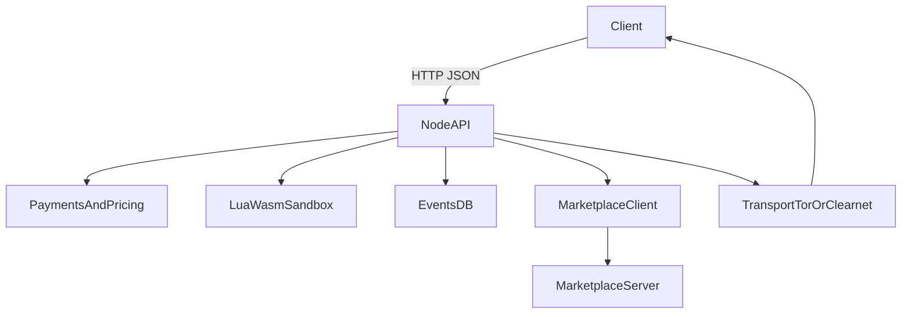

# Froglet

Froglet is a Rust edge node with three core primitives:

- Tor and clearnet transport modes
- persistent node identity backed by a local ed25519 key
- static per-endpoint pricing with Cashu token verification and replay protection

This repository now contains two binaries:

- `froglet`: the node runtime
- `marketplace`: the centralized discovery service

## Features

- Native Tor hidden service support through Arti
- Stable node identity stored under `./data/identity/ed25519.seed`
- Central marketplace publishing with signed register and heartbeat flows
- Signed reclaim flow for bringing a node identity back online
- Static endpoint pricing for `events.query`, `execute.lua`, and `execute.wasm`
- Cashu token parsing with local reservation/commit flow and execution receipts
- Sandboxed Lua and WASM execution
- Async job API with persisted state, polling, and idempotency keys
- SQLite state under `./data/node.db`
- SQLite tuned with WAL mode and busy timeout for better write/read behavior
 - Async-friendly SQLite access via a small `DbPool` wrapper

## Binaries

### Node

```bash
cargo run --bin froglet
```

### Marketplace

```bash
cargo run --bin marketplace
```

The marketplace listens on `127.0.0.1:9090` by default and stores state in `./data/marketplace.db`.

## Node Configuration

### Core transport

- `FROGLET_NETWORK_MODE=clearnet|tor|dual`
- `FROGLET_LISTEN_ADDR=127.0.0.1:8080`
- `FROGLET_DATA_DIR=./data`

### Discovery and marketplace

- `FROGLET_DISCOVERY_MODE=none|marketplace`
- `FROGLET_MARKETPLACE_URL=http://127.0.0.1:9090`
- `FROGLET_MARKETPLACE_PUBLISH=true|false`
- `FROGLET_MARKETPLACE_REQUIRED=true|false`
- `FROGLET_MARKETPLACE_HEARTBEAT_INTERVAL_SECS=30`

### Identity

- `FROGLET_IDENTITY_AUTO_GENERATE=true|false`

If auto-generation is enabled and no seed file exists, Froglet creates one on first boot and reuses it on subsequent starts.

### Pricing and payments

- `FROGLET_PRICE_EVENTS_QUERY=0`
- `FROGLET_PRICE_EXEC_LUA=0`
- `FROGLET_PRICE_EXEC_WASM=0`
- `FROGLET_PAYMENT_BACKEND=none|cashu`

If any price is greater than zero and `FROGLET_PAYMENT_BACKEND` is not set, Froglet defaults to `cashu`.

## Marketplace Configuration

- `FROGLET_MARKETPLACE_LISTEN_ADDR=127.0.0.1:9090`
- `FROGLET_MARKETPLACE_DB_PATH=./data/marketplace.db`
- `FROGLET_MARKETPLACE_STALE_AFTER_SECS=300`

If a published node stays offline longer than the stale threshold, the marketplace marks it inactive and requires signed reclaim before accepting fresh registrations from that identity again.

## Architecture Overview

At a high level, clients talk HTTP/JSON to the node API, which enforces pricing and payments, stores events in SQLite, optionally executes code in sandboxes, and (optionally) publishes its descriptor to the marketplace:



Security and performance-critical paths sit at the `payments` and `sandbox` layers: paid endpoints are enforced before entering the sandboxes, and the database is always accessed behind an async wrapper to avoid blocking the reactor.

## Example Flows

### Free local node

```bash
cargo run --bin froglet
```

### Public node that auto-publishes to marketplace

Start the marketplace:

```bash
cargo run --bin marketplace
```

Start the node:

```bash
FROGLET_DISCOVERY_MODE=marketplace \
FROGLET_MARKETPLACE_URL=http://127.0.0.1:9090 \
FROGLET_MARKETPLACE_PUBLISH=true \
cargo run --bin froglet
```

### Paid query endpoint

```bash
FROGLET_PRICE_EVENTS_QUERY=10 cargo run --bin froglet
```

Requests to `/v1/node/events/query` now require a payment object:

```json
{
  "kinds": ["note"],
  "limit": 5,
  "payment": {
    "kind": "cashu",
    "token": "cashuA..."
  }
}
```

If payment is missing, Froglet returns `402 Payment Required`.

### Async FaaS-style job submission

```json
POST /v1/node/jobs
{
  "kind": "lua",
  "script": "return input.greeting .. ', ' .. input.target",
  "input": {
    "greeting": "hello",
    "target": "world"
  },
  "idempotency_key": "hello-world-job"
}
```

Froglet returns a persisted job record immediately and clients can poll `GET /v1/node/jobs/:job_id` until the status changes to `succeeded` or `failed`.

## API Surface

### Node routes

- `GET /health`
- `GET /v1/node/capabilities`
- `GET /v1/node/identity`
- `POST /v1/node/events/publish`
- `POST /v1/node/events/query`
- `POST /v1/node/execute/lua`
- `POST /v1/node/execute/wasm`
- `POST /v1/node/jobs`
- `GET /v1/node/jobs/:job_id`
- `POST /v1/node/pay/ecash`

### Marketplace routes

- `GET /health`
- `POST /v1/marketplace/register`
- `POST /v1/marketplace/heartbeat`
- `POST /v1/marketplace/reclaim/challenge`
- `POST /v1/marketplace/reclaim/complete`
- `GET /v1/marketplace/nodes/:node_id`
- `GET /v1/marketplace/search`

## Capability Example

```json
{
  "api_version": "v1",
  "version": "0.1.0",
  "identity": {
    "node_id": "<pubkey-hex>",
    "public_key": "<pubkey-hex>"
  },
  "discovery": {
    "mode": "marketplace"
  },
  "marketplace": {
    "enabled": true,
    "publish_enabled": true,
    "url": "http://127.0.0.1:9090",
    "connected": true
  },
  "pricing": {
    "events_query": {
      "service_id": "events.query",
      "price_sats": 10,
      "payment_required": true
    }
  },
  "faas": {
    "jobs_api": true,
    "async_jobs": true,
    "idempotency_keys": true,
    "runtimes": ["lua", "wasm"]
  }
}
```

## Notes on Payments

Paid endpoint enforcement currently does two things:

- validates Cashu token structure and amount
- reserves the token locally before execution and only commits it on success
- returns a local payment receipt containing the service, amount, and token hash

If execution fails, Froglet releases the local reservation so the token is not consumed by a failed request.

It does **not** redeem tokens against a mint or wallet backend. Replay protection is strictly **local to a single node**: the token hash is only compared against the node's own `payment_redemptions` table, and a token could in principle be reused at other nodes that do not share this table.

The verifier is isolated behind a dedicated module so a stronger backend (for example, a real mint/wallet or remote verifier) can replace the current implementation without changing the API surface.

### Threat Model (Current)

- The node is expected to run in a controlled environment (edge node or personal server), exposed to untrusted clients over HTTP.
- API routes are unauthenticated by default; protection is based on:
  - static pricing and payment verification for sensitive endpoints,
  - input validation,
  - sandboxing of Lua and WASM with instruction/fuel caps and global concurrency limits,
  - basic rate limiting and explicit body size limits on publish/execute routes.
- Payments:
  - Cashu tokens are parsed and checked for amount.
  - A local reservation/commit flow prevents a successful token from being used twice **on the same node**.
  - Failed executions release their reservation and do not intentionally consume the token.
  - There is no global double-spend protection without an external mint/wallet integration.
- Storage and identities:
  - Identity seeds, database files, and Tor state/cache directories are created with strict `0o600/0o700` permissions on Unix.
  - Failure to secure Tor directories now causes startup to fail with a clear error.

If you deploy Froglet on the public internet, you should still front it with additional protections (reverse proxy, WAF, external rate limiting, etc.) and carefully tune prices and limits for your threat model.

### Operational Notes

- **Rotate identity**: stop the node, delete `./data/identity/ed25519.seed`, and restart with `FROGLET_IDENTITY_AUTO_GENERATE=true` to mint a fresh node identity.
- **Migrate DB**: stop the node, copy `./data/node.db` (and `./data/marketplace.db` if running the marketplace) to the new location, update `FROGLET_DATA_DIR`, and restart.
- **Toggle Tor/clearnet**:
  - Use `FROGLET_NETWORK_MODE=clearnet|tor|dual` to control which transports are enabled.
  - In `tor` mode, failure to start the Tor hidden service is treated as fatal.
- **Marketplace publishing**:
  - Use `FROGLET_MARKETPLACE_PUBLISH` and `FROGLET_MARKETPLACE_REQUIRED` to control whether publishing is best-effort or mandatory.
  - The node's marketplace sync loop now applies exponential backoff after repeated failures while keeping status information visible via `/v1/node/capabilities`.

## Development

Build and test:

```bash
cargo check
cargo test --lib --bins
```
