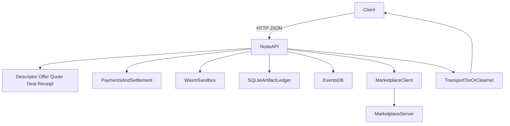

# 🐸 Froglet

Froglet is a Rust node for small economic coordination between agents. Its core primitive is a signed local ledger of identity descriptors, priced offers, short-lived quotes, accepted deals, and terminal receipts. Execution, marketplaces, and brokers sit on top of that primitive rather than replacing it.

Two binaries ship in this repo:

| Binary | Purpose |
|---|---|
| `froglet` | The node runtime |
| `marketplace` | Reference discovery service |

## Quick Start

**Free local node** (no payments):

```bash
cargo run --bin froglet
```

**Priced node with mock Lightning** (recommended for local bot development):

```bash
FROGLET_PRICE_EXEC_WASM=10 \
FROGLET_PAYMENT_BACKEND=lightning \
FROGLET_LIGHTNING_MODE=mock \
cargo run --bin froglet
```

**Node + marketplace** (discovery enabled):

```bash
# Terminal 1
cargo run --bin marketplace

# Terminal 2
FROGLET_DISCOVERY_MODE=marketplace \
FROGLET_MARKETPLACE_URL=http://127.0.0.1:9090 \
FROGLET_MARKETPLACE_PUBLISH=true \
cargo run --bin froglet
```

**Dual transport with Tor sidecar** (`tor` must be on `PATH`):

```bash
FROGLET_NETWORK_MODE=dual \
FROGLET_LISTEN_ADDR=127.0.0.1:8080 \
FROGLET_RUNTIME_LISTEN_ADDR=127.0.0.1:8081 \
FROGLET_TOR_BACKEND_LISTEN_ADDR=127.0.0.1:8082 \
cargo run --bin froglet
```

In this layout clearnet clients reach `:8080`, local bots reach `:8081`, and the `tor` sidecar exposes `:8082` as the onion service.

## Architecture



Quoted prices are enforced before execution. Terminal receipts are always signed. The database is accessed behind an async wrapper to avoid blocking the reactor.

## Configuration

### Node — Transport

| Variable | Default | Description |
|---|---|---|
| `FROGLET_NETWORK_MODE` | `clearnet` | `clearnet`, `tor`, or `dual` |
| `FROGLET_LISTEN_ADDR` | `127.0.0.1:8080` | Public provider API |
| `FROGLET_RUNTIME_LISTEN_ADDR` | `127.0.0.1:8081` | Privileged local runtime API |
| `FROGLET_TOR_BACKEND_LISTEN_ADDR` | `127.0.0.1:8082` | Internal backend the Tor sidecar publishes |
| `FROGLET_TOR_BINARY` | `tor` | Path to the `tor` executable |
| `FROGLET_TOR_STARTUP_TIMEOUT_SECS` | `90` | Seconds to wait for Tor bootstrap |
| `FROGLET_DATA_DIR` | `./data` | Root directory for all local state |

`FROGLET_RUNTIME_LISTEN_ADDR` and `FROGLET_TOR_BACKEND_LISTEN_ADDR` are separate trust boundaries — keep both on loopback.

### Node — Identity

| Variable | Default | Description |
|---|---|---|
| `FROGLET_IDENTITY_AUTO_GENERATE` | `false` | Create a seed file on first boot if none exists |

The identity seed is stored at `./data/identity/secp256k1.seed` and reused on every subsequent start.

### Node — Pricing and Payments

| Variable | Default | Description |
|---|---|---|
| `FROGLET_PRICE_EVENTS_QUERY` | `0` | Price in millisatoshis for `events.query` |
| `FROGLET_PRICE_EXEC_WASM` | `0` | Price in millisatoshis for `execute.wasm` |
| `FROGLET_PAYMENT_BACKEND` | `none` | `none` or `lightning` |
| `FROGLET_EXECUTION_TIMEOUT_SECS` | `10` | Wasm execution timeout; also published in offer constraints |
| `FROGLET_LIGHTNING_MODE` | — | `mock` or `lnd_rest` |
| `FROGLET_LIGHTNING_REST_URL` | — | LND REST endpoint (HTTPS for real nodes) |
| `FROGLET_LIGHTNING_TLS_CERT_PATH` | — | Pinned LND TLS cert (not a WebPKI CA bundle) |
| `FROGLET_LIGHTNING_MACAROON_PATH` | — | LND admin macaroon |
| `FROGLET_LIGHTNING_REQUEST_TIMEOUT_SECS` | `5` | Per-request timeout to LND |
| `FROGLET_LIGHTNING_SYNC_INTERVAL_MS` | `1000` | Background watcher reconciliation interval |

If any price is non-zero and `FROGLET_PAYMENT_BACKEND` is unset, Froglet defaults to `lightning`. The mainline priced flow is `quote → deal → receipt`.

### Node — Discovery

| Variable | Default | Description |
|---|---|---|
| `FROGLET_DISCOVERY_MODE` | `none` | `none` or `marketplace` |
| `FROGLET_MARKETPLACE_URL` | `http://127.0.0.1:9090` | Marketplace base URL |
| `FROGLET_MARKETPLACE_PUBLISH` | `false` | Register and send heartbeats |
| `FROGLET_MARKETPLACE_REQUIRED` | `false` | Treat publish failure as fatal |
| `FROGLET_MARKETPLACE_HEARTBEAT_INTERVAL_SECS` | `30` | Heartbeat cadence |

### Marketplace

| Variable | Default | Description |
|---|---|---|
| `FROGLET_MARKETPLACE_LISTEN_ADDR` | `127.0.0.1:9090` | Marketplace listener |
| `FROGLET_MARKETPLACE_DB_PATH` | `./data/marketplace.db` | State database |
| `FROGLET_MARKETPLACE_STALE_AFTER_SECS` | `300` | Inactivity threshold before a node is marked stale |

A stale node requires a signed reclaim challenge before it can re-register.

## API Reference

### Node routes (`:8080`)

| Method | Path | Notes |
|---|---|---|
| `GET` | `/health` | |
| `GET` | `/v1/descriptor` | Signed descriptor artifact |
| `GET` | `/v1/offers` | Current signed offers |
| `GET` | `/v1/feed` | Append-only artifact feed; use `?cursor=&limit=` for pagination |
| `GET` | `/v1/artifacts/:artifact_hash` | Content-addressed artifact lookup |
| `POST` | `/v1/quotes` | Request a signed quote |
| `POST` | `/v1/deals` | Open a deal against a quote |
| `GET` | `/v1/deals/:deal_id` | Poll deal status |
| `POST` | `/v1/deals/:deal_id/release-preimage` | Release success-fee preimage to settle hold invoice |
| `GET` | `/v1/deals/:deal_id/invoice-bundle` | Signed Lightning invoice bundle |
| `POST` | `/v1/invoice-bundles/verify` | Verify a bundle against its quote and deal |
| `POST` | `/v1/curated-lists/verify` | |
| `POST` | `/v1/nostr/events/verify` | |
| `POST` | `/v1/receipts/verify` | Verify a terminal receipt offline |
| `GET` | `/v1/node/capabilities` | Node capability snapshot |
| `GET` | `/v1/node/identity` | Node public identity |
| `POST` | `/v1/node/events/publish` | |
| `POST` | `/v1/node/events/query` | Free queries only |
| `POST` | `/v1/node/execute/wasm` | Free execution only |
| `POST` | `/v1/node/jobs` | Free execution only; use quotes/deals when priced |
| `GET` | `/v1/node/jobs/:job_id` | Poll async job |

### Runtime routes (`:8081`, bearer auth required)

| Method | Path | Notes |
|---|---|---|
| `GET` | `/v1/runtime/wallet/balance` | Confirm wallet backend is live |
| `POST` | `/v1/runtime/provider/start` | Bootstrap snapshot; returns descriptor, offers, and token path |
| `POST` | `/v1/runtime/services/publish` | Publish current provider surface |
| `POST` | `/v1/runtime/services/buy` | Authenticated buy flow; returns `payment_intent` |
| `GET` | `/v1/runtime/deals/:deal_id/payment-intent` | Current BOLT11 strings and leg states |
| `POST` | `/v1/runtime/discovery/curated-lists/issue` | Issue a signed curated list |
| `GET` | `/v1/runtime/nostr/publications/provider` | Signed Nostr summary for descriptor + offers |
| `GET` | `/v1/runtime/nostr/publications/deals/:deal_id/receipt` | Signed Nostr summary for a terminal receipt |
| `GET` | `/v1/runtime/archive/:subject_kind/:subject_id` | Evidence archive bundle |
| `POST` | `/v1/runtime/lightning/invoice-bundles/:session_id/state` | Mock Lightning only — advance settlement state |

### Marketplace routes (`:9090`)

| Method | Path | Notes |
|---|---|---|
| `GET` | `/health` | |
| `POST` | `/v1/marketplace/register` | Register a node |
| `POST` | `/v1/marketplace/heartbeat` | Keep registration alive |
| `POST` | `/v1/marketplace/reclaim/challenge` | Begin signed reclaim flow |
| `POST` | `/v1/marketplace/reclaim/complete` | Complete reclaim |
| `GET` | `/v1/marketplace/nodes/:node_id` | Node detail |
| `GET` | `/v1/marketplace/search` | Search registered nodes |

## Python SDK

`python/froglet_client.py` provides three async helpers:

| Class | Purpose |
|---|---|
| `MarketplaceClient` | `search` and node lookup |
| `ProviderClient` | `quote → deal → wait → accept → receipt` |
| `RuntimeClient` | Authenticated local bot flows, curated-list issuance, payment-intent inspection |

Requester-side signing helpers (client-side only — nothing private goes over HTTP):

```python
from froglet_client import generate_requester_seed, requester_id_from_seed, runtime_requester_fields

seed = generate_requester_seed()
requester_id = requester_id_from_seed(seed)
fields = runtime_requester_fields(seed, success_preimage)
```

`RuntimeClient` should point at the runtime listener; `ProviderClient` at the public provider listener. The runtime auth token is at `./data/runtime/auth.token`.

See [docs/BOT_RUNTIME_ALPHA.md](docs/BOT_RUNTIME_ALPHA.md) for the full supported bot surface and [examples/README.md](examples/README.md) for runnable integrations.

## Nostr Publication

`python/froglet_nostr_adapter.py` is the external relay bridge. It fetches descriptor/offer/receipt publication intents from the runtime surface and publishes them to relays over websocket. Relay policy stays outside the core node.

```bash
# Simple relay list
python3 python/froglet_nostr_adapter.py --relay wss://relay.example

# Policy file with read/write roles
python3 python/froglet_nostr_adapter.py --relay-config relay-policy.json

# With NIP-42 auth
python3 python/froglet_nostr_adapter.py \
  --relay wss://relay.example \
  --auth-seed-file ./data/identity/nostr-publication.secp256k1.seed
```

Example policy file:

```json
{
  "relays": [
    {"url": "wss://relay-write.example", "read": false, "write": true},
    {"url": "wss://relay-read.example", "read": true, "write": false}
  ],
  "retry": {
    "max_attempts": 3,
    "initial_backoff_secs": 0.25,
    "max_backoff_secs": 2.0
  }
}
```

## Payments

### Deal flow (priced)

```
POST /v1/quotes   →  signed quote
POST /v1/deals    →  payment_pending
                      (pay base fee + accept hold invoice)
                  →  result_ready
POST /v1/deals/:id/release-preimage  →  signed receipt (succeeded)
```

The runtime buy flow (`POST /v1/runtime/services/buy`) wraps this for local bots and returns a `payment_intent` with payable BOLT11 strings so bots do not need to parse raw invoice-bundle legs. Invoice expiries are clamped to the remaining quote lifetime. Lightning-backed deals are reconciled in the background after restart.

### Threat model

- Routes are unauthenticated by default. Protection relies on static pricing, quote/deal enforcement, Wasm sandboxing (fuel caps, memory caps, concurrency limits), rate limiting, and body size limits.
- Priced flows use signed quotes, signed deals, and Lightning invoice bundles.
- The requester controls the success-preimage release step for hold invoices.
- Identity seeds, database files, and Tor sidecar directories are created with `0o600/0o700` permissions. Insecure Tor sidecar directories cause startup to fail.

> If you deploy on the public internet, front Froglet with a reverse proxy, WAF, and external rate limiting.

## Operations

| Task | Steps |
|---|---|
| **Rotate identity** | Stop node → delete `./data/identity/secp256k1.seed` → restart with `FROGLET_IDENTITY_AUTO_GENERATE=true` |
| **Migrate DB** | Stop node → copy `./data/node.db` (and `marketplace.db`) → update `FROGLET_DATA_DIR` → restart |
| **Toggle Tor** | Set `FROGLET_NETWORK_MODE=clearnet\|tor\|dual`; in `tor` mode a failed hidden service is fatal; in `dual` mode clearnet keeps serving if Tor drops |
| **Marketplace publish** | `FROGLET_MARKETPLACE_REQUIRED=true` makes publishing fatal; `false` applies exponential backoff and keeps status visible via `/v1/node/capabilities` |

## Support Matrix

**Stable primitive** (frozen kernel contract):

- Signed descriptor, offer, quote, deal, receipt, curated-list, and invoice-bundle artifacts
- Local SQLite-backed artifact, deal, job, and evidence persistence
- Public provider routes for descriptor, offers, quotes, deals, verification, feed, and archive-backed artifacts
- Restart recovery for `payment_pending` and `result_ready` deal state

**Supported alpha** (may evolve):

- `/v1/runtime/*` routes and Python SDK helpers
- Marketplace publish/search flows
- External Tor sidecar transport
- `lnd_rest` Lightning integration
- Nostr adapter publication helpers

**Dev/test only**:

- Mock-Lightning state mutation via `/v1/runtime/lightning/invoice-bundles/:session_id/state`
- Env-gated Tor and LND regtest harnesses

## Development

```bash
cargo check
cargo test --lib --bins
python3 -m unittest discover -s python/tests -t . -v
```

Run the Dockerized LND regtest topology:

```bash
FROGLET_RUN_LND_REGTEST=1 python3 -m unittest -v python/tests/test_lnd_regtest
```

Run the local verification matrix:

```bash
./scripts/strict_checks.sh
```

## Docs

| Doc | Contents |
|---|---|
| [SPEC.md](SPEC.md) | Frozen v1 economic kernel — canonical artifacts, hashing, signing, state model |
| [CONTRIBUTING.md](CONTRIBUTING.md) | How to contribute, pre-PR checklist, conformance vector guidance |
| [docs/ARCHITECTURE.md](docs/ARCHITECTURE.md) | Layer breakdown: kernel → adapters → runtime → marketplace |
| [docs/BOT_RUNTIME_ALPHA.md](docs/BOT_RUNTIME_ALPHA.md) | Supported bot-facing alpha surface |
| [docs/OPERATOR.md](docs/OPERATOR.md) | Wallet setup, auth, archive export, recovery |
| [docs/RUNTIME.md](docs/RUNTIME.md) | Runtime design and compatibility endpoints |
| [docs/ADAPTERS.md](docs/ADAPTERS.md) | Transport, Lightning, and Nostr adapter design |
| [docs/NOSTR.md](docs/NOSTR.md) | Nostr publication behavior |
| [docs/STORAGE_PROFILE.md](docs/STORAGE_PROFILE.md) | SQLite storage profile |
| [docs/REMOTE_AGENT_LAYER.md](docs/REMOTE_AGENT_LAYER.md) | Planned evolution beyond the alpha runtime |
| [python/README.md](python/README.md) | Python SDK and test layout |
| [examples/README.md](examples/README.md) | Runnable Python integrations |
| [higher_layers/README.md](higher_layers/README.md) | Marketplace and addon planning (pre-extraction) |
