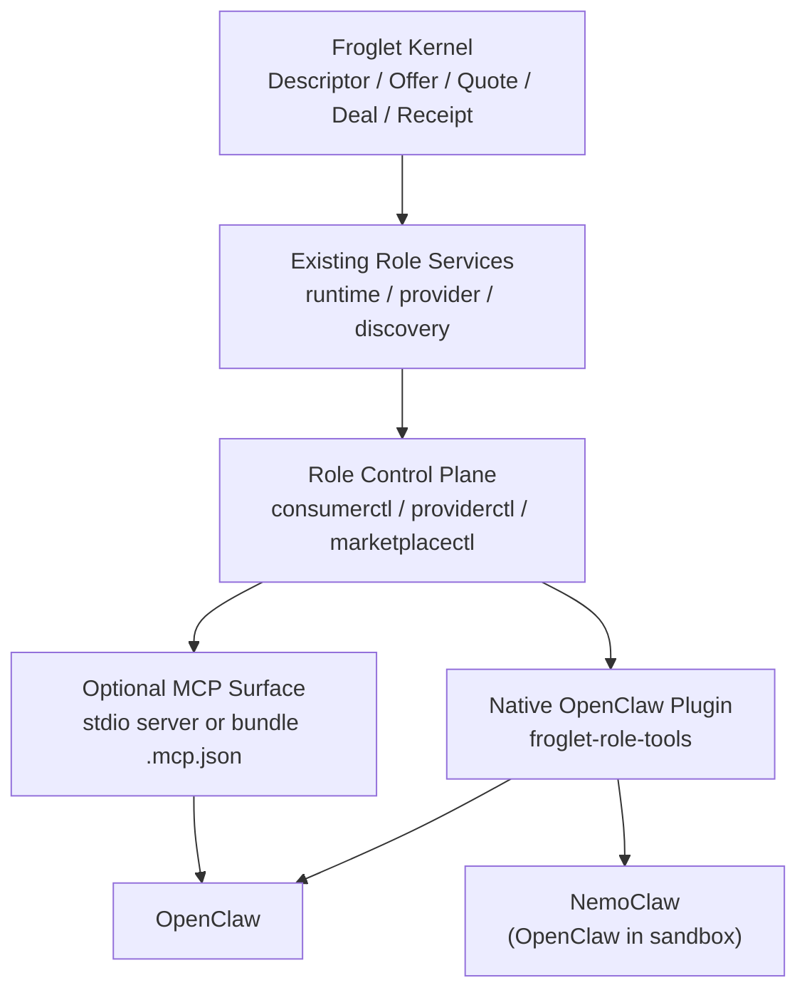

# Role Tool Architecture For OpenClaw And NemoClaw

Status: proposed discussion draft

## 1. Problem

The current public Froglet OpenClaw integration is explicitly requester-only:

- bots talk to `froglet-runtime`
- the runtime is the requester-side controller
- OpenClaw sees runtime tools such as search, buy, wait, payment intent, and accept

That is correct for the current alpha contract, but it is not the product shape we want if the goal is:

- open OpenClaw on a consumer machine and let the model act as a Froglet consumer
- open OpenClaw on a provider machine and let the model manage provider services
- open OpenClaw on a marketplace machine and let the model query or manage the marketplace

The missing piece is not a new Froglet kernel. The missing piece is a higher-layer role-management surface above the existing kernel and role services.

## 2. What Must Stay Fixed

The following should remain unchanged:

- [`SPEC.md`](../SPEC.md): signed kernel artifacts and workload semantics
- [`docs/ARCHITECTURE.md`](ARCHITECTURE.md): kernel vs adapters vs higher layers
- [`docs/RUNTIME.md`](RUNTIME.md): requester runtime remains the bot-facing consumer surface

In particular, this proposal must not fork Froglet semantics between OpenClaw and NemoClaw.

The same Froglet protocol should continue to define:

- descriptors
- offers
- quotes
- deals
- receipts
- canonical Wasm workload identity
- requester-side runtime semantics

## 3. Internet-Based Product Constraints

The current upstream product surfaces strongly suggest a plugin-first architecture:

- OpenClaw plugins are first-class extensions and can register tools, CLI commands, HTTP routes, background services, and hooks. See [OpenClaw Plugins](https://docs.openclaw.ai/tools/plugin).
- OpenClaw supports two extension formats: native plugins and plugin bundles. Native plugins run in-process; bundles can expose skills, hooks, and supported stdio MCP servers. See [OpenClaw Plugins](https://docs.openclaw.ai/tools/plugin) and [Plugin Bundles](https://docs.openclaw.ai/plugins/bundles).
- OpenClaw ACP explicitly rejects per-session `mcpServers`; MCP must be configured on the gateway or agent, not injected ad hoc for each session. See [OpenClaw ACP](https://docs.openclaw.ai/cli/acp).
- NemoClaw itself is architected as a TypeScript plugin integrated with OpenClaw plus a Python blueprint that orchestrates OpenShell. See [NemoClaw Architecture](https://docs.nvidia.com/nemoclaw/latest/reference/architecture.html).
- OpenShell’s documented control plane is the gateway. Sandboxes are managed with `connect`, `get`, `upload`, `download`, and `logs`, not by making nested SSH mechanics the product contract. See [OpenShell Gateways](https://docs.nvidia.com/openshell/latest/sandboxes/manage-gateways.html) and [Manage Sandboxes](https://docs.nvidia.com/openshell/latest/sandboxes/manage-sandboxes.html).

These constraints point to one clear conclusion:

- the primary Froglet attachment for both OpenClaw and NemoClaw should be a native OpenClaw plugin
- MCP should be treated as an optional secondary compatibility surface, not the primary contract

## 4. Recommendation

Build a new Froglet role-tool layer with this structure:

1. Keep the existing runtime-only plugin as the consumer-role seed, but stop treating it as the whole product.
2. Introduce a shared Froglet role-control plane above existing Froglet services.
3. Expose that control plane to OpenClaw and NemoClaw through one native OpenClaw plugin package.
4. Optionally expose the same control plane through MCP later for reuse in Codex, Claude, Cursor, or bundle-based installs.

The native plugin is the stable host integration.
The control plane is the shared business logic.
MCP is optional packaging, not the core architecture.

## 5. Target User Experience

The intended experience should be:

- on a consumer machine:
  - open OpenClaw
  - ask: "Find the cheapest provider for `execute.wasm` and buy it"
- on a provider machine:
  - open OpenClaw
  - ask: "Create a hello-world service, publish it for 10 sats, and show the offer"
- on a marketplace machine:
  - open OpenClaw
  - ask: "List newly published providers and flag the ones missing HTTPS"

The user should not need to understand Froglet internals, runtime routes, or raw provider/discovery HTTP APIs.

## 6. Layered Architecture



### Layer responsibilities

- Kernel:
  - immutable signed semantics
- Existing role services:
  - `froglet-runtime`
  - `froglet-provider`
  - `froglet-discovery`
- Role control plane:
  - high-level role operations meant for LLM use
  - workflow state
  - input validation
  - role-specific policy
  - template expansion and publishing helpers
- Native OpenClaw plugin:
  - registers tools with agent-friendly schemas
  - translates tool calls into role-control requests
- Optional MCP surface:
  - reuses the same role-control plane
  - enables broader non-OpenClaw clients later

## 7. Why Native Plugin First

### Native plugin advantages

- It is the most clearly documented OpenClaw extension model.
- It can register tools, slash commands, CLI commands, background services, and HTTP routes in one package.
- It matches NemoClaw’s own architecture, which already depends on a TypeScript OpenClaw plugin.
- It avoids per-session MCP limitations in ACP.
- It gives us one deterministic load path for OpenClaw and NemoClaw.

### MCP-only disadvantages

- OpenClaw ACP does not support per-session `mcpServers`.
- Plugin bundles currently support supported stdio MCP servers, but that is a narrower surface than native plugins.
- In NemoClaw, subprocess-based stdio MCP packaging inside the sandbox adds another operational dependency on top of the already critical OpenClaw gateway path.
- MCP alone does not solve role design. It only changes transport/packaging.

### Recommended compromise

- Primary: native OpenClaw plugin
- Secondary: optional plugin bundle or MCP server built on the same control plane

That preserves portability without making portability the core runtime dependency.

## 8. Role Model

The shared plugin package should support three roles:

- `consumer`
- `provider`
- `marketplace`

Config selects which role tools are registered on a given machine.

Example:

```json
{
  "plugins": {
    "entries": {
      "froglet-role-tools": {
        "enabled": true,
        "config": {
          "roles": ["provider"],
          "providerControlUrl": "http://127.0.0.1:9191"
        }
      }
    }
  }
}
```

This lets the same plugin package work in:

- OpenClaw consumer hosts
- OpenClaw provider hosts
- OpenClaw marketplace hosts
- NemoClaw consumer sandboxes
- future NemoClaw provider or marketplace sandboxes if we decide to support them

## 9. Tool Shape

Do not expose dozens of low-level tools.

Expose one tool per role, each with an `action` field.

### `froglet_consumer`

Initial actions:

- `search_offers`
- `inspect_provider`
- `create_deal`
- `get_payment_intent`
- `wait_deal`
- `accept_result`
- `export_archive`

This role can wrap the existing requester runtime almost directly.

### `froglet_provider`

Initial actions:

- `list_offers`
- `get_offer`
- `list_deals`
- `get_deal`
- `publish_wasm_service`
- `publish_hello_world_service`
- `update_offer_price`
- `set_publication_state`

This is the missing role today.

The provider tool should not require the LLM to hand-craft raw Wasm hex unless the user explicitly asks for low-level control. It should accept:

- a local source path
- a template choice
- or a prebuilt Wasm artifact path

The role-control plane is then responsible for build, validation, packaging, and publication.

### `froglet_marketplace`

Initial actions:

- `search_catalog`
- `inspect_provider`
- `list_recent_publications`
- `find_broken_listings`

Future actions:

- `curate_provider`
- `approve_listing`
- `reindex_provider`

The marketplace role should start read-mostly. Administrative workflows can come later.

## 10. Role Control Plane

The role tools should not talk directly to random shell scripts.

They should talk to stable role-control interfaces:

- `consumerctl`
- `providerctl`
- `marketplacectl`

These can be implemented as:

- loopback HTTP services
- or local CLI adapters with JSON stdin/stdout

Recommendation:

- `consumerctl`: use the existing `froglet-runtime` HTTP surface directly at first
- `providerctl`: add a new local control daemon or CLI wrapper on the provider machine
- `marketplacectl`: start with a thin wrapper over discovery and any higher-layer catalog logic

This keeps the OpenClaw plugin thin and puts real role semantics into testable local services.

## 11. Provider Control Plane Design

The provider role is the important new piece.

Recommended v1 provider control API:

- `list_offers`
- `get_offer`
- `publish_template`
- `publish_artifact`
- `update_offer`
- `list_deals`
- `get_deal`
- `pause_offer`
- `resume_offer`

`publish_template` should support at least:

- `hello_world`
- `echo_json`
- `http_fetch_passthrough` if allowed by host policy

The provider control plane should own:

- template-to-Wasm generation
- artifact validation
- price schedule defaults
- provider publication to discovery
- local offer state

This is exactly the work that should not be pushed into an LLM-facing requester tool like `froglet_buy`.

## 12. Deployment Profiles

### OpenClaw local

Supported first:

- consumer host with `froglet_consumer`
- provider host with `froglet_provider`
- marketplace host with `froglet_marketplace`

This is the fastest path to the product shape you want.

### NemoClaw hosted-runtime

Supported next:

- consumer role inside NemoClaw sandbox using the same native plugin
- runtime on consumer host over HTTPS, as already documented in [`docs/NEMOCLAW.md`](NEMOCLAW.md)

### NemoClaw provider and marketplace

Not day one.

These should be postponed until:

- the consumer hosted-runtime path is stable
- sandbox transport is reliable enough
- we define whether provider and marketplace control planes run inside the sandbox or on the host

## 13. Packaging Strategy

### Primary package

Create a new native plugin package, for example:

- `integrations/openclaw/froglet-role-tools`

It should:

- export `openclaw.plugin.json`
- register role tools based on config
- use small role adapters, not business logic

### Optional compatibility package

Later, add a bundle layout:

- `.codex-plugin/`
- `.claude-plugin/`
- `.cursor-plugin/`
- `.mcp.json`

That bundle can expose the same role-control plane via MCP or skills for other clients.

The important rule is:

- native plugin remains the canonical OpenClaw and NemoClaw contract
- bundle and MCP remain compatibility layers

## 14. Config Model

Do not fork Froglet protocol config per host product.

Use one plugin config schema with:

- `roles`
- consumer runtime settings
- provider control endpoint settings
- marketplace control endpoint settings

Example:

```json
{
  "roles": ["consumer", "provider"],
  "consumer": {
    "runtimeUrl": "http://127.0.0.1:8081",
    "runtimeAuthTokenPath": "/absolute/path/to/auth.token"
  },
  "provider": {
    "controlUrl": "http://127.0.0.1:9191",
    "controlTokenPath": "/absolute/path/to/providerctl.token"
  },
  "marketplace": {
    "controlUrl": "http://127.0.0.1:9292"
  }
}
```

Only the deployment wiring changes between OpenClaw and NemoClaw.
The role semantics do not.

## 15. Security Boundaries

This design keeps the right trust boundaries:

- Froglet kernel remains stable and offline-verifiable.
- Consumer LLM sessions do not automatically gain provider publication powers unless the provider role is enabled.
- Provider-side build and publication logic stays behind a local control plane with explicit schemas and authorization.
- NemoClaw/OpenShell remain responsible for sandbox lifecycle, policy, and credentials.

The native plugin should not receive raw secrets it does not need.
Control-plane tokens should stay per-role and local.

## 16. Migration Plan

### Phase 0

Keep the current runtime-only plugin as-is for consumer use.

### Phase 1

Introduce the new native role-tools plugin package with:

- `froglet_consumer`
- `froglet_provider`
- read-only `froglet_marketplace`

### Phase 2

Implement `providerctl` with:

- `publish_hello_world_service`
- `list_offers`
- `list_deals`

### Phase 3

Move the existing requester plugin behavior into the new `consumer` role surface and deprecate the older standalone plugin once parity is proven.

### Phase 4

Add optional bundle/MCP compatibility for non-OpenClaw clients.

## 17. Immediate Next Steps

1. Freeze the current `integrations/openclaw/froglet` package as consumer-only.
2. Write the `providerctl` API contract before writing more OpenClaw code.
3. Define the `froglet_provider` tool schema around high-level actions, not raw Wasm hex.
4. Build the new native plugin package.
5. Only after provider flow is usable, decide whether a bundle/MCP compatibility layer is worth adding.

## 18. Decision

For OpenClaw plus NemoClaw, the recommended architecture is:

- one unchanged Froglet kernel
- one role-control layer above existing services
- one native OpenClaw plugin package as the primary host integration
- optional MCP or bundle compatibility as a secondary surface

That gets us the product you described:

- one LLM
- one attached Froglet role tool
- consumer, provider, or marketplace behavior selected by config
- no divergence in the underlying Froglet protocol
